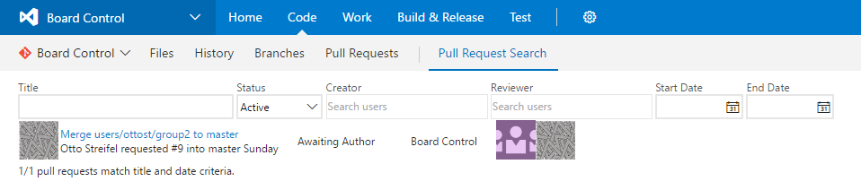

Allows pull requests to be filtered by creator, reviewer, title, start date, end date, and repository.

Searches are scoped to all repositories of the current project.

# Change Log

v1.7.5

Adds change log

Updates inputs picture in details page.

Adds creator image tooltip

v1.7.3

Sort repos by name

v1.7.1

Adds Repository search clause

v1.6.16

Updates email address.

Remove default to current team.

v1.6.15

Fixes bug in identity picker configuration

v1.6.1

Adds defaults to current team

v1.5.9

Updates email.

v1.5.4

Makes all profile pictures the same size

v1.5.1

Header info text. Adds links to the github repo, store page, and support email at top of search hub.

v1.4.6

Updates inputs image on details page

v1.4.5

Updates details page

v1.4.1

Allows 'Find more' behavior. At bottom of search results user may now click to include the next 100 match pull requests in the search results.

v1.3.10

Adds text at bottom showing how many pull requests match title and date filter criteria of those that match the search criteria.

v1.3.6

Adds filtering by start and end date

v1.3.1

Adds filtering by title

v1.2.1

Live queries, no more search button. Search runs on criteria change.

v1.1.8

ie support

v1.1.5

Adds pr status, results scrollbar, profile image tooltips

v1.1.3

Updates image in details page

v1.1.1

Adds identity pickers for search

v1.0.1

Initial release