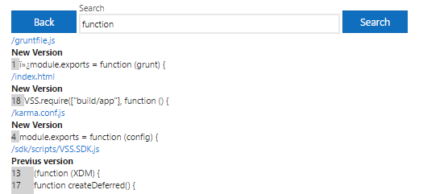

Allows pull requests to be filtered by status, creator, reviewer, title, start date, end date, and repository.  

By default extension searchs all active pull requests in all repositories.

Search file contents and names.  

# Change Log
(03/05/17) 1.13.1 Removing hash urls  
(03/05/17) 1.12.1 Filtering by approval status  
(03/02/17) 1.11.1 Autopaging and hash urls  
(02/16/17) 1.10.27 Removes unrelated files from content search  
(02/13/17) 1.10.14 Fixes bugs searching file contents  
(02/12/17) 1.10.1 Adds search ability to search file contents  
(01/27/17) 1.9.12 Fixes onprem link issue  
(01/27/17) 1.9.8 Changes loading message  
(01/24/17) 1.9.1 Adds refresh button  
(12/16/16) 1.8.12 Compacts change log
(12/16/16) 1.8.11 Changes team name display  
(12/16/16) 1.8.9 Squashes bug with identitical display names in identity picker.  
(12/16/16) 1.8.1 Replaces built in identity pickers to workaround authentication and on premise issues.  
(12/15/16) 1.7.9 Updates extension target  
(11/19/16) 1.7.7 Updates details  
(11/19/16) 1.7.5 Adds change log  
Updates inputs picture in details page.  
Adds creator image tooltip  
(11/15/16) 1.7.3 Sort repos by name  
(11/13/16) 1.7.1 Adds Repository search clause  
(11/09/16) 1.6.16 Updates email address.  
Remove default to current team.  
(11/09/16) 1.6.15 Fixes bug in identity picker configuration  
(11/09/16) 1.6.1 Adds defaults to current team  
(11/08/16) 1.5.9 Updates email.  
(11/08/16) 1.5.4 Makes all profile pictures the same size  
(11/08/16) 1.5.1 Header info text. Adds links to the github repo, store page, and support email at top of search hub.  
(11/07/16) 1.4.6 Updates inputs image on details page  
(11/07/16) 1.4.5 Updates details page  
(11/07/16) 1.4.1 Allows 'Find more' behavior. At bottom of search results user may now click to include the next 100 match pull requests in the search results.  
(11/07/16) 1.3.10 Adds text at bottom showing how many pull requests match title and date filter criteria of those that match the search criteria.  
(11/07/16) 1.3.6 Adds filtering by start and end date  
(11/07/16) 1.3.1 Adds filtering by title  
(11/07/16) 1.2.1 Live queries, no more search button. Search runs on criteria change.  
(11/07/16) 1.1.8 ie support  
(11/07/16) 1.1.5 Adds pr status, results scrollbar, profile image tooltips  
(11/06/16) 1.1.3 Updates image in details page  
(11/06/16) 1.1.1 Adds identity pickers for search  
(11/04/16) 1.0.1 Initial release